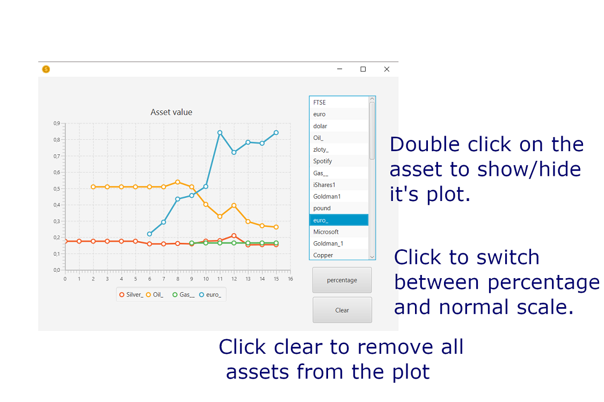

<h1>MARKET SIMULATOR VER 1.0.0</h1><h3>Sebastian Chwilczyński 148248<h3>

If you have done any changes and you want to generate new documentation run: 
`mvn javadoc:javadoc`  
If you want to create new executable jar file run (Unfortunately JaCoCo is complaining, and I didn't have time to fix it. Will be fixed with new release):  
`mvn clean package -Djacoco.skip=true`  
Finally if you want to run executable (**You must have [javaFX](https://gluonhq.com/products/javafx/)**** downloaded**) perform these steps (windows):
1. Create environmental variable pointing to folder with javaFX:
    * `set PATH_TO_FX="C:\Program Files\Eclipse Adoptium\javafx-sdk-17.0.1\lib"`
2. Go to the directory with the jar file and run this command:
    * `java --module-path %PATH_TO_FX% --add-modules javafx.fxml,javafx.controls -jar market_simulator-1.0.0.jar`
  

<h2>Quick image instruction: </h2>

<h3> Important aspects: </h3>

1. Even though internally we exchange a lot between difference currencies (some assets are available to buy only with specific currency -> then we offer some exchanges), values on plots and in tooltips are in **Main asset** which basically is a **virtual** backup for each currency. It is done to make interpretations easier.
2. You can't specify where and under what name simulation is saved. There is some default save name, which is always overwritten. To make a read you first need to make a save!
3. You have to run `threadTest` as a normal Java program. Somehow threads were not working in JUnit.
4. Updates of all rates happens once a `virtual` day. Information about change is accumulated during the day and when next day is starting program updates all rates and dynamic indices.